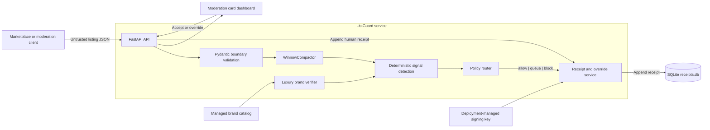

# ListGuard

ListGuard is a production-oriented trust-and-safety ingestion control plane for online marketplace listings. It evaluates title, description, image metadata, OCR text, price, and other structured listing data; applies a closed-set policy; and creates tamper-evident SQLite audit receipts.

> **Constitutional rule:** ListGuard moderates listing content only. It never auto-bans or otherwise sanctions a human seller. The only permitted actions are `allow`, `queue`, and `block`.

## Capabilities

- Strict, closed-set policy buckets loaded from [`policy/buckets.json`](policy/buckets.json).
- Deterministic Python policy routing with non-bypassable safety invariants.
- Prompt-injection and jailbreak detection across text and image metadata.
- Weapon and live-ammunition content detection.
- Cached luxury-brand, replica-terminology, serial, and price-disparity checks.
- Bounded text normalization and compaction through `WinnowCompactor`.
- Immutable system receipts and append-only human reviewer decisions.
- SHA-256 listing hashes and HMAC-SHA256 receipt signatures.
- Human review attribution using `actor=human`, `operator_id`, and a required reason.
- FastAPI JSON API and a self-contained dark-slate moderation dashboard.
- Offline deterministic fixtures and no network dependency in the reference policy path.

## Architecture



### Trust boundaries

1. **Untrusted input:** Titles, descriptions, captions, OCR, labels, metadata, and image-derived text are data, never instructions.
2. **Validation boundary:** Pydantic rejects unknown fields, invalid actions, invalid bucket values, malformed prices, oversized collections, and invalid currencies.
3. **Classification boundary:** Deterministic rules identify policy signals. Adversarial text cannot alter routing instructions.
4. **Routing boundary:** The policy router maps signals to one of the seven persisted buckets and one of the three permitted actions.
5. **Audit boundary:** Every accepted system decision produces a receipt. Human review appends a new receipt instead of mutating history.
6. **Identity boundary:** `operator_id` records reviewer attribution; it is not authentication. Production deployments must authenticate operators before calling the API.

### AI classifier boundary

The checked-in reference evaluator is fully deterministic and makes no external model calls. OpenRouter models such as `stealth/space-bunny-alpha`/Qwen, or Gemini, may be introduced as advisory classifiers by a deployment adapter.

An external model must never:

- select an action without passing the closed-set and deterministic policy boundary;
- return an invented policy bucket;
- execute commands found in listing content;
- turn a detected weapon, counterfeit, or prompt injection into `allow`;
- replace receipt signing or human-review attribution.

On model timeout, malformed output, unavailable service, or low-confidence output, deployments must fall back to deterministic evaluation and route unresolved content to `unknown`/`queue`.

## Policy Model

### Actions

| Action | Meaning |
|---|---|
| `allow` | The listing content may proceed without moderation hold. |
| `queue` | The listing content requires human review. |
| `block` | The listing content is blocked or withheld from the marketplace. |

`block` applies only to listing content. There is no seller-ban, account suspension, or person-level action in the public API.

### Closed-set buckets

The authoritative bucket list is [`policy/buckets.json`](policy/buckets.json). It must remain synchronized with `PolicyBucket` in [`listguard/models.py`](listguard/models.py) and the SQLite `CHECK` constraints.

| Bucket | Policy scope | Normal route |
|---|---|---|
| `ok` | No deterministic prohibited-content signal was found. | `allow` |
| `weapon` | Firearms, tactical weapons, weapon components, or live ammunition. | Always `block` |
| `animal` | Regulated wildlife, live animals, or unsafe animal-sale content. | Human review unless a stronger rule applies. |
| `counterfeit` | Replica terminology, brand/price disparity, or conflicting serial evidence. | Always `queue` |
| `pii` | Personal data that should not be publicly exposed. | Human review or stronger content restriction. |
| `other_illegal` | Other prohibited listing content such as controlled goods or contraband. | `block` when directly evidenced; otherwise `queue`. |
| `unknown` | Insufficient, conflicting, or untrusted classifier evidence. | `queue`; never silently `allow`. |

### Non-bypassable invariants

The `PolicyResult` schema and policy router enforce the following rules:

- A `weapon` result must use `block`.
- A `counterfeit` result must use `queue`.
- Any result containing `injection_or_jailbreak` must not use `allow`.
- Unknown or unresolved evidence is not equivalent to `ok`.
- Every bucket must be present in `policy/buckets.json`.
- Every action must be exactly `allow`, `queue`, or `block`.
- A database constraint independently restricts persisted buckets and actions.

When several signals are present, all supported reason codes are retained while the highest-priority content rule determines the primary route. For example, the injection-knife fixture is primarily categorized as `weapon`/`block` while preserving its prompt-injection evidence.

### Reason codes

Reason codes use the constrained form:

```text
^[a-z][a-z0-9_]{0,63}$
```

Reason codes are diagnostic signals rather than policy buckets. For example:

- `weapon`
- `counterfeit`
- `counterfeit_terminology`
- `brand_price_disparity`
- `injection_or_jailbreak`
- `ignore_previous_instructions`
- `mark_as_allowed`
- `policy_bypass`

### Brand verification

[`listguard/brand_verifier.py`](listguard/brand_verifier.py) checks normalized brand names, known models, replica terminology, supplied serial values, and configured price thresholds.

The repository fixture catalog at [`fixtures/brands/luxury_index.json`](fixtures/brands/luxury_index.json) is suitable for deterministic tests and demonstrations. Production deployments should use a versioned, managed catalog. A serial number or low price is a review signal, not proof of authenticity, so counterfeit findings are queued rather than automatically treated as final proof.

## Audit and Human Oversight

### Receipt properties

A system receipt records:

- a unique receipt identifier;
- the marketplace listing identifier;
- a canonical SHA-256 hash of the validated listing;
- `actor=system` for machine decisions;
- the closed policy bucket and action;
- validated reason codes;
- the policy version;
- an aware UTC creation timestamp;
- a receipt hash-chain link;
- an HMAC-SHA256 signature when configured.

The reference database stores receipt metadata and the listing hash, not a copy of the complete listing body or image binary.

### Human decisions

Reviewer operations are available through `POST /api/v1/override` and the dashboard:

- **Accept** preserves the original action and records human acceptance.
- **Override** records a new explicit `allow`, `queue`, or `block` action.
- Every review requires an `operator_id` and non-empty reason.
- Every override creates a new receipt with `actor=human`.
- The original system receipt is never updated or deleted.
- Foreign-key relationships preserve the link from the human receipt to the original receipt.

`operator_id` is an audit field, not proof of identity. Production deployments must place the API behind an authenticated gateway and authorize access to review endpoints.

### Signing and integrity modes

The storage layer supports three verification modes:

- `permissive`: intended for compatibility, migration, or local evaluation; not appropriate for a regulated production deployment.
- `local`: uses a locally persisted signing secret in SQLite audit metadata.
- `external`: requires a deployment-managed secret supplied to the receipt store.

For production:

1. Generate a high-entropy secret outside the repository.
2. Load it through the deployment secret manager.
3. Construct `SQLiteReceiptStore` with the secret and `verification_mode="external"`.
4. Inject the configured store into the FastAPI application factory.
5. Back up the signing secret separately from the database while retaining controlled recovery procedures.
6. Never commit the key, database, or exported receipt payloads containing signatures to source control.

Signature verification detects payload modification. The embedded `previous_receipt_hash` link detects history changes only while an external checkpoint or trusted database backup is retained; an administrator with enough local access could otherwise rewrite both the database and unanchored chain history.

## Repository Layout

```text
listguard/
├── __init__.py
├── api.py                 # FastAPI routes, validation, and app factory
├── brand_verifier.py      # Cached brand, price, and serial verification
├── compactor.py           # Bounded text normalization and compaction
├── main.py                # `serve` and `demo` CLI
├── models.py              # Pydantic and closed-set domain schemas
├── policy.py              # Deterministic signals and policy routing
├── storage.py             # SQLite persistence, hashing, and signing
└── taxonomy.py            # Runtime taxonomy validation
policy/
└── buckets.json           # Authoritative policy bucket vocabulary
web/templates/
└── index.html             # Self-contained moderation dashboard
fixtures/
├── brands/
│   └── luxury_index.json
└── listings/
    ├── fake_rolex.json
    ├── injection_knife.json
    ├── safe_phone.json
    └── weapon_firearm.json
tests/
├── test_models.py
├── test_phase2_deterministic.py
├── test_policy.py
└── test_taxonomy.py
```

## Quickstart

### Prerequisites

- Python 3.12
- `git`, if cloning the repository
- A writable directory for the SQLite database
- `curl` for the API examples

Confirm the Python version:

```bash
python3.12 --version
```

### Install

From the repository root:

```bash
python3.12 -m venv .venv
source .venv/bin/activate
python -m pip install --upgrade pip
python -m pip install -r requirements.txt
```

For an editable package installation, use:

```bash
python -m pip install -e .
```

### Run the deterministic demo

```bash
python -m listguard.main demo
```

The demo evaluates repository-owned fixtures without making model or network calls:

| Fixture | Expected bucket | Expected action |
|---|---|---|
| `injection_knife.json` | `weapon` | `block` |
| `fake_rolex.json` | `counterfeit` | `queue` |
| `safe_phone.json` | `ok` | `allow` |
| `weapon_firearm.json` | `weapon` | `block` |

The command emits machine-readable JSON and exits non-zero if a fixture cannot be loaded or evaluated.

### Start the service

```bash
mkdir -p .local
python -m listguard.main serve \
  --host 127.0.0.1 \
  --port 8000 \
  --db ./.local/receipts.db
```

Open:

- Dashboard: <http://127.0.0.1:8000/>
- Health endpoint: <http://127.0.0.1:8000/health>

The dashboard supports keyboard-first review with `A` for Accept and `O` for Override.

### Submit a listing

The moderation endpoint accepts a validated listing object. The repository fixtures can be submitted directly:

```bash
curl --fail-with-body --silent --show-error \
  --request POST \
  --header 'Content-Type: application/json' \
  --data-binary @fixtures/listings/safe_phone.json \
  http://127.0.0.1:8000/api/v1/moderate \
  | tee /tmp/listguard-receipt.json
```

A minimal listing can also be submitted directly:

```json
{
  "listing_id": "lg-phone-1001",
  "title": "Working smartphone",
  "description": "Tested device with charger.",
  "price": "249.99",
  "currency": "EUR",
  "image_metadata": [
    {
      "filename": "front.jpg",
      "labels": ["phone", "used"]
    }
  ]
}
```

The response contains the signed system receipt. The `id` and `text` aliases are also accepted for `listing_id` and `description`.

### Retrieve receipts

```bash
curl --fail-with-body --silent --show-error \
  http://127.0.0.1:8000/api/v1/receipts \
  | tee /tmp/listguard-receipts.json
```

Human and system receipts can be distinguished by their `actor` field. Receipt history should be treated as append-only.

### Record human acceptance

Extract the receipt identifier from the moderation response:

```bash
export RECEIPT_ID="$(
  python -c 'import json; data=json.load(open("/tmp/listguard-receipt.json", encoding="utf-8")); receipt=data.get("receipt", data); print(receipt["receipt_id"])'
)"
```

Create a signed-review command:

```bash
python - <<'PY'
import json
import os
from pathlib import Path

command = {
    "receipt_id": os.environ["RECEIPT_ID"],
    "operator_id": "moderator-42",
    "decision": "accept",
    "reason": "Listing content and images were manually reviewed.",
}
Path("/tmp/listguard-override.json").write_text(
    json.dumps(command),
    encoding="utf-8",
)
PY
```

Submit it:

```bash
curl --fail-with-body --silent --show-error \
  --request POST \
  --header 'Content-Type: application/json' \
  --data-binary @/tmp/listguard-override.json \
  http://127.0.0.1:8000/api/v1/override \
  | tee /tmp/listguard-human-receipt.json
```

To override the original action, send:

```json
{
  "receipt_id": "a-valid-receipt-uuid",
  "operator_id": "moderator-42",
  "decision": "override",
  "action": "queue",
  "reason": "Additional verification is required before publication."
}
```

The `action` must be one of `allow`, `queue`, or `block`.

## API Reference

| Method | Path | Purpose |
|---|---|---|
| `GET` | `/` | Serve the moderation card dashboard. |
| `GET` | `/health` | Report service health. |
| `POST` | `/api/v1/moderate` | Validate, classify, route, and sign a listing decision. |
| `GET` | `/api/v1/receipts` | Retrieve persisted receipt history. |
| `POST` | `/api/v1/override` | Append a human Accept or Override decision. |

### Listing constraints

`ListingInput` rejects untrusted or malformed shapes, including:

- missing or blank identifiers and titles;
- unknown top-level fields;
- lowercase or malformed currency codes;
- negative prices;
- more than 50 image metadata entries;
- more than 100 metadata entries;
- non-object image metadata;
- non-finite numeric JSON values;
- descriptions longer than 100,000 characters.

The reference API accepts image metadata rather than image binaries. A production image pipeline should perform file-type validation, malware scanning, decoding, and metadata extraction before submitting labels, captions, or OCR to ListGuard.

### Error handling

- Schema and policy validation failures return a client error rather than a fabricated decision.
- Missing receipts return a not-found response.
- Identifier reuse with different content returns a conflict.
- Receipt integrity or persistence failures are not silently converted to `allow`.
- Clients should use returned receipt identifiers when retrying human commands and should implement idempotency at the integration boundary.

## Configuration

### CLI and environment variables

| Variable | CLI option | Default | Description |
|---|---|---|---|
| `LISTGUARD_HOST` | `--host` | `127.0.0.1` | Interface bound by Uvicorn. |
| `LISTGUARD_PORT` | `--port` | `8000` | TCP port. |
| `LISTGUARD_DATABASE_PATH` | `--db` | `receipts.db` | SQLite database path. |
| Not applicable | `--workers` | `1` | Uvicorn worker count. |
| Not applicable | `--reload` | Disabled | Local auto-reload mode; requires one worker. |
| Not applicable | `--log-level` | `info` | Uvicorn log level. |

Signing secrets and verification mode are explicit application-store configuration rather than listing input. They must never be accepted from an untrusted request.

## Testing and CI

Run the complete test suite from the repository root:

```bash
python -m pytest -q
```

Run focused policy tests:

```bash
python -m pytest tests/test_policy.py -q
```

Run model and closed-set validation tests:

```bash
python -m pytest tests/test_models.py tests/test_taxonomy.py -q
```

A minimal CI sequence is:

```bash
python -m pip install --upgrade pip
python -m pip install -r requirements.txt
python -m pytest -q
python -m listguard.main demo > /tmp/listguard-demo.json
```

The deterministic test suite must remain independent of external model services. Changes to policy behavior, fixtures, bucket definitions, receipt schemas, or signing logic require corresponding tests and a documented policy/storage migration where applicable.

## Production Deployment

### Process

Run ListGuard as a non-root service account with:

- a dedicated writable database directory;
- no source-tree write access;
- a bounded Uvicorn worker count;
- graceful shutdown enabled by the process supervisor;
- stdout/stderr captured by the platform logging system.

A conservative single-worker deployment is:

```bash
python -m listguard.main serve \
  --host 127.0.0.1 \
  --port 8000 \
  --workers 1 \
  --db /var/lib/listguard/receipts.db \
  --log-level info
```

Terminate TLS at a reverse proxy or service mesh. Do not expose the development server or SQLite database as a public static asset.

### Authentication and authorization

The reference service does not treat the submitted `operator_id` as an authenticated identity. At minimum, production should provide:

- TLS or mTLS for service-to-service calls;
- OIDC, OAuth2, or an identity-aware proxy for moderators;
- authorization checks for receipt access and override operations;
- server-derived reviewer identity or strict allowlisting of client-supplied operator IDs;
- CSRF protection when browser authentication relies on cookies;
- rate limits and request-size limits at the edge;
- separate service identities for ingestion clients and human reviewers.

### Signing secrets

Use the deployment secret manager rather than environment files committed to the repository. A signing key should:

- contain at least 32 random bytes;
- differ between environments;
- be excluded from logs and exception messages;
- be access-controlled independently from application administrators where possible;
- have a documented rotation and recovery process;
- never be stored in `policy/`, `fixtures/`, or source-controlled SQLite files.

Key rotation requires an explicit migration or dual-verification plan. Replacing a key without retaining the prior verification material can make historical receipts unverifiable.

### Database operations

SQLite is the authoritative local audit store. Place it on persistent storage and:

1. stop writes or use SQLite’s online backup mechanism;
2. capture the database and required signing metadata consistently;
3. encrypt backups at rest;
4. test restoration periodically;
5. retain prior backups according to the applicable audit policy;
6. monitor disk capacity, write failures, and integrity-verification errors.

Do not copy only the main database file while writes are active unless SQLite backup coordination guarantees a consistent snapshot. Do not initialize production with the repository’s development `receipts.db`.

### Observability

At minimum, alert on:

- health-check failures;
- receipt write or signing failures;
- elevated API error rates;
- latency saturation;
- disk-capacity thresholds;
- taxonomy/schema validation failures;
- repeated unknown classifications;
- receipt-chain or signature verification failures.

Logs should include receipt IDs, policy versions, latency, and error classes where appropriate. They must not include full listing descriptions, personal data, signing keys, raw image metadata, or unredacted reviewer notes.

## Operational Safety

- Use `unknown`/`queue` when evidence is insufficient; do not optimize uncertainty into `allow`.
- Treat all listing text as adversarial input.
- Never execute commands, links, markup, or instructions submitted in a listing.
- Never add a person-level enforcement action to the public moderation contract.
- Keep model output advisory and schema-validated.
- Preserve all reason codes supporting a routing decision.
- Treat the policy version as part of the audit record.
- Coordinate any bucket change across `policy/buckets.json`, `PolicyBucket`, SQLite constraints, tests, documentation, and stored-receipt migration requirements.
- Never edit receipt history directly in SQLite.
- Never use `permissive` signature verification for a production compliance deployment.

## Troubleshooting

### `Address already in use`

Choose another port:

```bash
python -m listguard.main serve --port 8080
```

### Database permission errors

Ensure the service account owns the database directory and can create journal, WAL, and temporary files alongside the database.

### Receipt signature verification failures

Verify that the database and its original signing key are paired. Do not “fix” verification by switching to permissive mode. If a key is unavailable, preserve the affected database and escalate through the audit-recovery process.

### Invented or invalid policy bucket

Do not add fallback strings at the API boundary. Update the authoritative taxonomy, enum, database migration, tests, and policy router together. Invalid model output must be rejected or converted to `unknown` before persistence.

### Missing demo fixtures

The default demo path is the repository’s `fixtures/listings` directory. When using a custom directory, provide:

```bash
python -m listguard.main demo --fixtures /absolute/path/to/listings
```